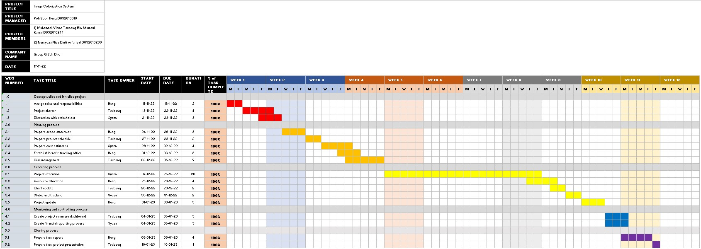
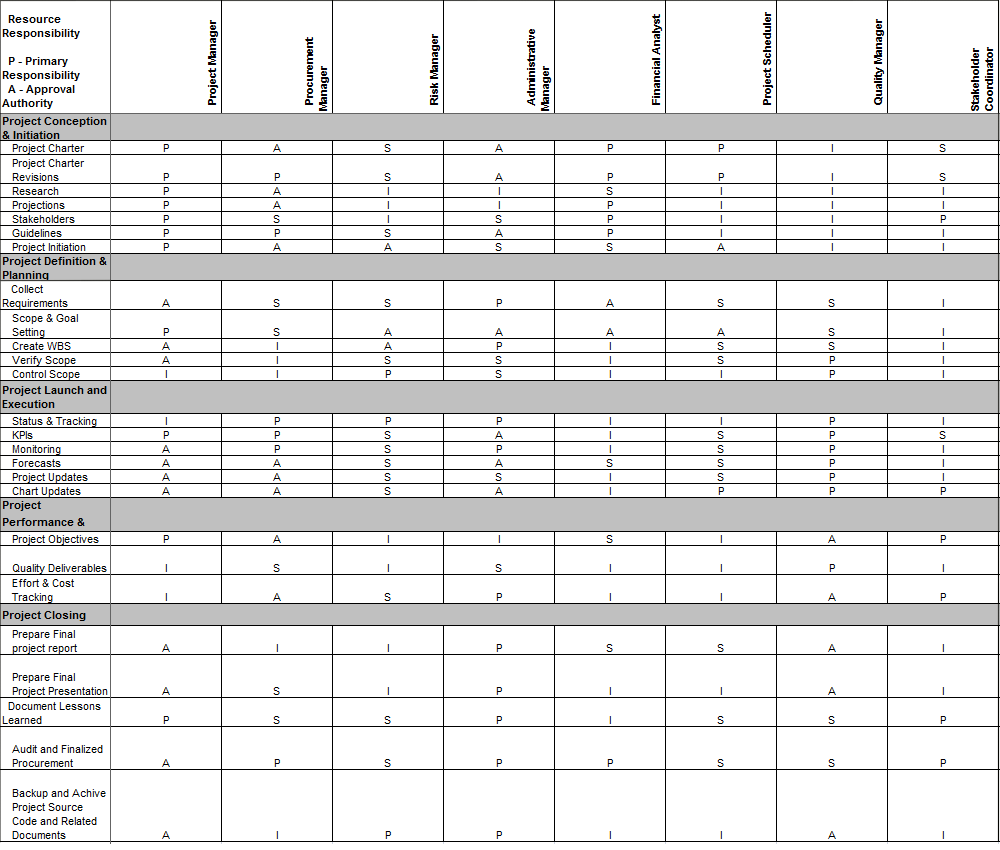
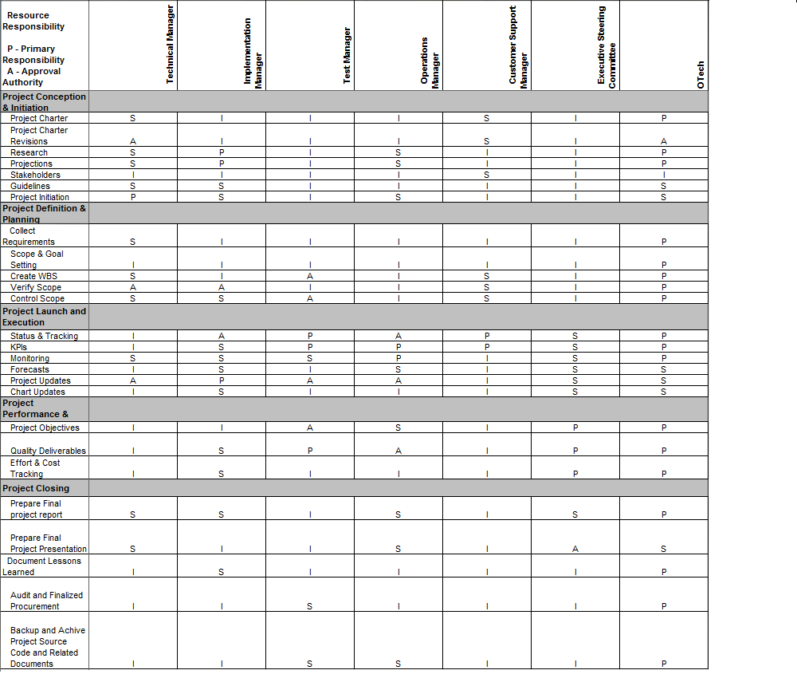

# PROJECT OVERVIEW
## B. PLANNING THE PROJECT

### Project Management Life cycle

The project management life cycle is represented and documented in the form of a Gantt Chart, which allows staff to follow guidelines and meet milestones on a regular basis. The project life cycle divides the tasks and work of each member, such as the project manager, into several modules. Based on the Work Breakdown Structure constructed, each member has their own roles and parts in each stage of the lifecycle.
Work Breakdown Structure is shown in the Gantt Chart below:

### Scope
A Work Breakdown Structure (WBS) is created to map out all of the necessary tasks and to develop the process that will be maintained and approved for the WBS.

In this image colorization project, we need to identify the scope of the project. For instance, the project is not able to colorize some image naturaly and visually accepted. The colorize image might not look nice and the color used may not be suitable.

### Risk Identification Chart (Quality, Cost, Time)

| Control Element | What is likely to go wrong? | How and when will I know? | What will I do about it? |
|-----|----|-------|-----|
|Quality   (Poor attitude toward quality; substandard design, materials, and workmanship; inadequate quality assurance program)|1. Inadequate Quality Assurance Program: The system will also colorize the RGB images    2. Inadequate Quality Assurance Program: The quality of the AI model is biased towards a certain colorized images.  |How: The output image will colorize the RGB images into other colors    When: The quality problem is determined during the testing phase|Assign one member to keep on collecting the data day to day and increased the training process until a satisfied result is determined.|
|Cost   (Estimating errors; inadequate productivity, cost, change, or contingency)|1. Contigency: The costing of the system will be spike if the system faces errors and bugs.    2. Inadequate productivity: Team members are affected by Covid-19 and unable to deliver what they suppossed to deliver which lead to extra cost and time need to allocated. |How: The monthly bills shows unexpected extra charged to the bills.  When: The problem most probably will be encountered during the project execution and project implementation.|Notify the owner through email or discord if the budget exceed threshold.
|Time   (Errors in estimating time or resource availability; errors in determining the critical path; poor allocation and management of float; early release of competitive products) | 1. Project not able to reach the milestone set  as described in the Gantt Chart.    2. Erros in estimating resource availability: There are not enough dataset to be used to run the image colorization model training  |How: The members are stuck with a certain problem and drag all the other team members    When: The problem will be encountered during the project excution and monitoring phase.| Ask support from the other team member and switch their task or job to other job to avoid him/her to stuck in the problem loop.|

### Responsibility Assignment Matrices (RAM)

 

|Roles|
 Person In Charge 
|Responsibilities|
|:-----:|:------:|------|
| Project Manager | Poh Soon Heng |All project office management activities are reported to the Project Director by the Project Manager. The Project Manager plans, directs, and supervises the day-to-day internal activities that support the Project Office, as well as assists in the creation of the master project schedule and all other project work plans. This Project will require the project manager to identify who we can pitch our idea to and who is likely to accept it. The project manager must also ensure that all initiation and planning documents, such as the Work Breakdown Structure (WBS) and Gantt chart, are constructed in a clear and complete manner..    The Project Manager is responsible for the creation, upkeep, and adherence to the Project Office infrastructure and supporting methodologies (e.g., processes, procedures, standards, and templates) that are in accordance with OSI Best Practices and policies. The Project must also continue to monitor the project to ensure that it is progressing in accordance with the project scope and requirements. If a problem arises, the project manager must take corrective action.|
| Procurement Manager | Poh Soon Heng | The Procurement Manager oversees and manages the generation of the RFP or RFO and other solicitation documents. Other areas of the project office may be assigned responsibility for specific sections, but the Procurement Manager is responsible for integrating all the pieces and ensuring consistency and continuity throughout the entire procurement process and conforming to procurement standards, rules, and regulations. This includes managing the RFP or RFO development, preparing and maintaining procurement schedule, coordinating contract negotiations and managing evaluation of proposals or offers and selection of vendor.    The procurement manager needs to negotiate the contract, policies and deadlines of the project with each of the members. Moreover, procurement manager needs to ensure that no staff can buy any stuffs related using company’s money. Every expense needs to be approved by procurement manager.
| Risk Manager | Nursyaza Nisa | The Risk Manager is in charge of managing and tracking risks, as well as risk mitigation and contingencies on the project. The Risk Manager also oversees prime contractor risk management efforts to ensure they do not jeopardise the project. The Risk Manager manages and tracks potential and active risks, maintains the risk management tool and documentation information, leads project risk identification sessions, monitors prime contractor risk management efforts, and participates in division-level risk management activities for risks that cross project boundaries or are beyond the project's control.   Any risks in this project must be identified. As a result, the risk manager must list each and every risk so that they can avoid and take precautions to ensure that the problem does not occur.
| Administrative Manager | Iman Tsubaaq | The Administrative Manager leads the cost management effort, which includes sponsoring cost budgeting and tracking activities, facilitating communication on fiscal status, and ensuring the project cost tool and supporting documentation are maintained. The Administrative Manager also provides reports, recommendations, and status updates on the project budget and expenditures, such as planned vs. actual reports, as well as initiates corrective action and re-planning activities.   After each process for this project, the administrative manager needs to list out every possible thing that can be presented in the documentation form. For example, the activity report, and any documentation related to cost. This role is very important to make sure everyone and everything works under a standard procedure according to the documentation, and also avoid wastage in terms of time and money.|
| Financial Analyst | Poh Soon Heng | The Financial Analyst is in charge of assisting the Administrative Manager by managing and tracking the budget/costs of image colorization projects, coordinating/preparing budgetary documents such as Special Project Reports and OSI Budget Change Proposals, reviewing budget/contract expenditures, and collecting and reporting financial metrics. This includes reconciling the accounting and cost management processes, as well as developing financial management policies and procedures.    The Financial Analyst also assists in the evaluation of the cost and administrative sections of proposals based on the criteria in the Evaluation Plan during project solicitations, evaluations, and award processes.    Following that, the primary role of a financial analyst is to sift through data in order to identify opportunities and evaluate the outcomes. |
| Project Scheduler | Iman Tsubaaq | The Project Scheduler's role is to coordinate and manage plan inputs such as tracking progress against the project schedule, merging and identifying dependencies and risks between the project schedule, and tracking progress on the prime contractor's and counties' schedules.    In short, the Project Scheduler's job is to design the progress flow and track it in order to keep the system's development progress under control and to avoid unexpected risk caused by delays or interruptions in progress. |
| Quality Manager | Nursyaza Nisa | The Quality Manager is in charge of overseeing and ensuring the quality of the image colorization system as well as the Prime Contractor. By reviewing process and product activities for adherence to standards and plans, the Quality Manager provides insight into the project and contractor methods of doing business.    The quality manager is very important in our project because he or she must examine all of the system's quality and evaluate the final output so that the system can produce the output without error. Finally, the quality manager will report to upper management, such as the project manager, on the quality standard issues so that the project can be improved.|
| Stakeholder Coordinator | Poh Soon Heng |To ensure successful implementation and ongoing maintenance, the Stakeholder Coordinator serves as the primary liaison between stakeholders and the Project Office.  The Coordinator manages stakeholder-related issues and ensures timely resolution, in addition to overseeing critical ongoing stakeholder communication. Stakeholder issues are managed by the Coordinator by developing and maintaining the portion of the Issue and Escalation Process that affects the stakeholders. In reports and meetings, the Stakeholder Coordinator communicates risks and issues to the affected stakeholders. In conjunction with the Project schedule, the Stakeholder Coordinator coordinates stakeholder schedules for Project planning and implementation activities.  In this role, a stakeholder's sensitive information must be kept secure and only accessible by the project's key person. The stakeholder coordinator must prioritise those who are important to us and work to ensure that they invest in or support our project.|
| Technical Manager | Nursyaza Nisa | The Technical Manager is in charge of the day-to-day activities of state and vendor technical staff involved in the project's technical management. The technical manager and system engineer will partially co-lead the project's technical disciplines but will not complete the entire project.    The role of the Technical Manager is to collaborate with other IT managers to obtain appropriate technical assistance for areas such as enterprise architecture, database, software development, security, testing, configuration management, change management, release management, and other technical aspects of the new system. The Technical Manager will collaborate with the system engineer to provide leadership and support to project-supplied technical staff throughout the project's life cycle.    Aside from that, the Technical Manager is responsible for providing technical support to the Project Director, Project Manager, and other Project Office managers in order to establish and implement technical policies, processes, and procedures. |
| Implementation Manager | Iman Tsubaaq |The Implementation Manager will be in charge of the project's implementation by providing implementation management leadership by planning, organising, coordinating, and monitoring implementation activities. Furthermore, the Implementation Manager is responsible for managing all information technology resources delegated by the project manager, such as implementation strategy, organisational change management, production support, IT training, defect or problem tracking, and Maintenance & Operation. The Implementation Manager will coordinate SOWs and work directly with contractors to ensure that all objectives and expectations are met.    The role of the Implementation Manager in this project is to act as a liaison between the project leader and the system developer, transferring instructions from the manager and assisting in the management of the developer's work.
| Test Manager | Poh Soon Heng | The Test Manager is in charge of coordinating the testing of the Prime Contractor's system. The Manager collaborates with the Quality Management team to create test cases and data that best represent "real-life" scenarios for the system. The Test Manager is also in charge of coordinating interface tests with other organisations (county, state, and federal) as needed. They plan, monitor, and evaluate prime contractor test plans, as well as the problem reporting and resolution process. |
| Operations Manager | Nursyaza Nisa | The Operations Manager is in charge of coordinating and overseeing the new system's operations. Any solutions to problems encountered throughout the project must be approved by the operation Manager. For example, if they are having difficulty colorizing the grayscale image, the operation Manager has the authority to decide what action to take, whether to improve the system in terms of hardware or software. Furthermore, the operation Manager is responsible for administration and operational activities.|
| Customer Support Manager | Iman Tsubaaq | The Customer Support Manager is in charge of supervising M&O Contractor service efforts as well as assisting customers with special requests or problems. The Customer Support Manager is responsible for monitoring contractor service levels and metrics, as well as providing customer perspective and problem prioritisation.    The support manager for this image colorization project must assist customers in answering questions and faqs via email, phone, and social media chat. This role is critical because it makes customers feel welcomed and important.|
| Executive Steering Committee | Poh Soon Heng | The Executive Steering Committee serves as the project stakeholders group, ensuring that the project's deliverables and functionality are met as outlined in the project initiation documents and subsequent project management plans. This committee is responsible for providing high-level project direction, receiving project status updates, and addressing and resolving issues, risks, or change requests.    Furthermore, the Executive Steering Committee must make decisions regarding the project's financial management. He assesses progress against each work page's specific objectives, milestones, and deliverables. |
| Office of Technology Services (OTech) Representative | Nursyaza Nisa | The OTech Representative serves as a liaison between the Project Office and the OTech, assisting the project in determining the feasibility of services, cost estimates, planning, and other technical assistance to assist the project in making informed data centre decisions.    This role is critical because it will assist our company in determining which technologies and stacks are important. We can only check risk management and assessibility after determining the technology stack and requirements. As a result, OTech is critical in ensuring a company's correct technology stack and cost. |

     
##### Next: [Project Implementation](C-Project_Implementation.md)
