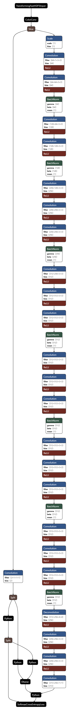

# PROJECT OVERVIEW

## C. IMPLEMENTING THE PROJECT PLAN
### Deliverables:

#### Hardware Requirement:
The hardware requirement to conduct this project consist of intel core i5 and 8GB RAM.

#### Software Requirement:
The software requirement used for this project in implementing the code for artificial intelligence module for image colorization is Python programming language.

#### Intelligent System Architecture:
The proposed neural network is ImageNet, which is a type of convolution neural network (CNN).
Image-Net architecture:

#### Outcomes of the system
The main steps to be applied in the Image Colorization System is to perform classification, detection and segmentation of the image. Given the input image, we evaluate the colorization quality by training the network on the images from the ImageNet training set. Next, we evaluate the feature representation learned through this kind of cross-channel encoding. In this evaluation, we tested the model using the self-supervision benchmarks on PASCAL classification, detection, and segmentation. 

### Tasks and Estimated Costs

| Task |  Estimated Costs | Notes |
|-----|----|----|
|   Server Maintenance         |$22000                         |  Monthly Cloud Server      |      
|   Construction supervision   |$35000                         | Supervision on the project | 
|   Cultural resources         |$85000                         |  Investigate and evaluate undertaking                                                 |                              |
|   Equipment and equipment use|$600                           | Equipment preparation and setup                                                       |                              |
|   Project signs              |$500                           |  Installation of project signs     |                            |
|   TOTAL                      |$143100                        |  Estimated     |                              |

### Milestone Chart
#### Microsoft Project:

#### Power Point:
The flags indicate the milestones of our image colorization project

   
##### Next: [Project Execution](D-Project_Execution.md)
