# PROJECT OVERVIEW
## D. EXECUTING THE PROJECT
### Project Design and Coding

Flowchart Design:

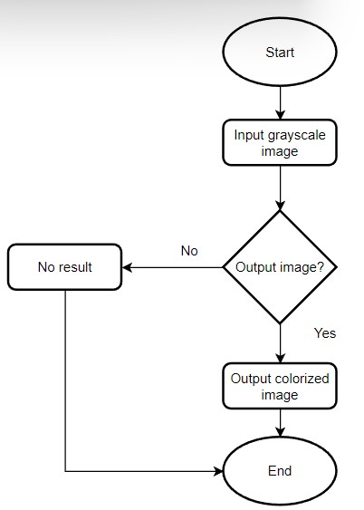

## Description of the project coding implementation

Firstly, we will import some useful libraries. The library needed for Image Colorization project are numpy and cv2. NumPy is a library for the Python programming language, adding support for large, multi-dimensional arrays and matrices, along with a large collection of high-level mathematical functions to operate on these arrays. While cv2 is OpenCV-Python which is a library of Python bindings designed to solve computer vision problems.

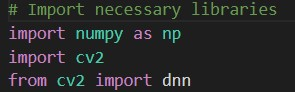

Next, for the ease of the project we will use the pre-trained model. We will declare variables and provide the path of the pre-trained model and images. Note that, we use ‘r’ before the path name. This is because backslash is used to signify special characters in Python. Path names on Windows tend to have backslashes in them. But we want them to mean actual backslashes, not special characters. ‘r’ stands for "raw" and will cause backslashes in the string to be interpreted as actual backslashes rather than special characters. That’s why the ‘r’ is used. proto_file is the path to the Caffe prototxt file. model_file is the path to the Caffe pre-trained model. hull_pts is the path to a NumPy cluster center points file. Lastly, the img_path is the path of the grayscale input image.

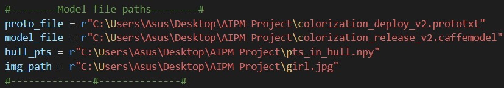

Now, we will use dnn, which is previously import from cv2 library. The dnn.readNetFromCaffee() is used to read a network model stored in Caffe framework’s format. The proto_file contains text description of the network architecture and the model_file contains learned network. We also use np.load() to load arrays objects from hull.npy file which is declared as hull_pts.

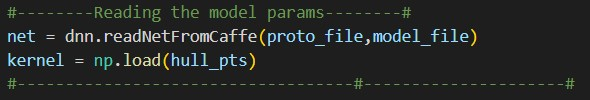

After the above processes are done, reading and preprocessing image can be start. imread() is used to read the input image. After reading the image, it will return a new DataFrame where the data type of all columns has been set to “float32” and divided by 255. Then, cvtColor() function is used to convert the image from RGB to CIE Lab.

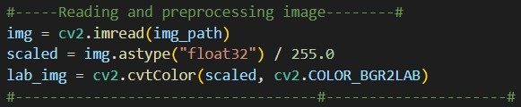

Load centers for ab channel quantization used for rebalancing. Treat each of the points as 1x1 convolutions and add them to the model.

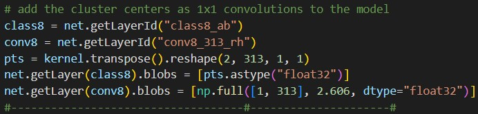

We'll go ahead and resize the input image to 224x224, the required input dimensions for the network. Then, we grab the L channel only and perform mean subtraction.

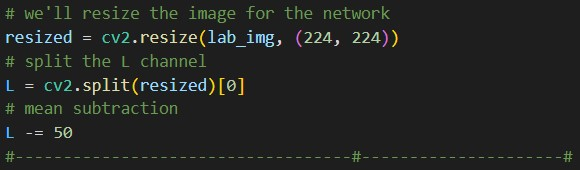

A forward pass of the L channel through the network takes place. Note that after net.forward, on the same line, we went ahead and extracted the predicted ab volume. From there, we resize the predicted ab volume to be the same dimensions as our input image. 

Grabbing the L channel from the original input and concatenating the original L channel and predicted ab channels together forming colorized.

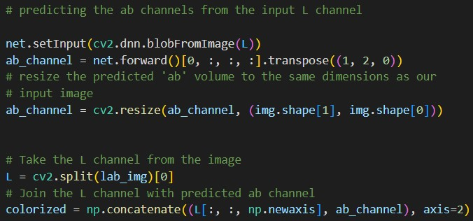

Converting the colorized image from the lab colour space to RGB. Then clipping any pixel intensities that fall outside the range [0,1]. Bringing the pixel intensities back into the range [0,255]. During the preprocessing we divided by 255 and now we are multiplying by 255. The "uint8" conversion isn't a requirement but it helps the code work between OpenCV 3.4.x and 4.x versions.

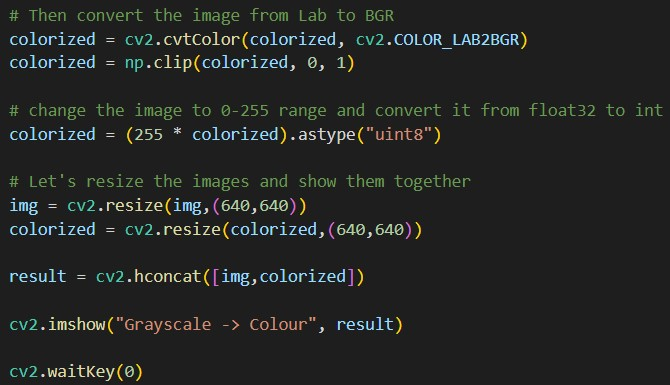

## Project Result
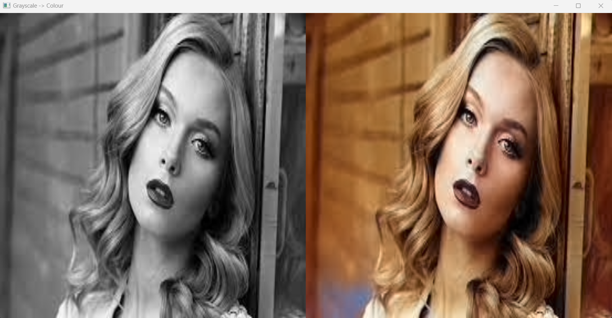
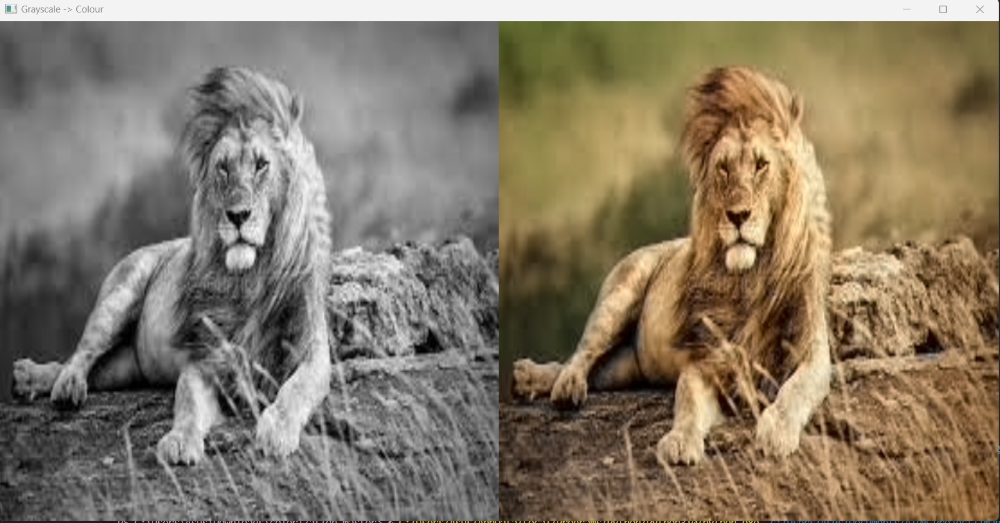
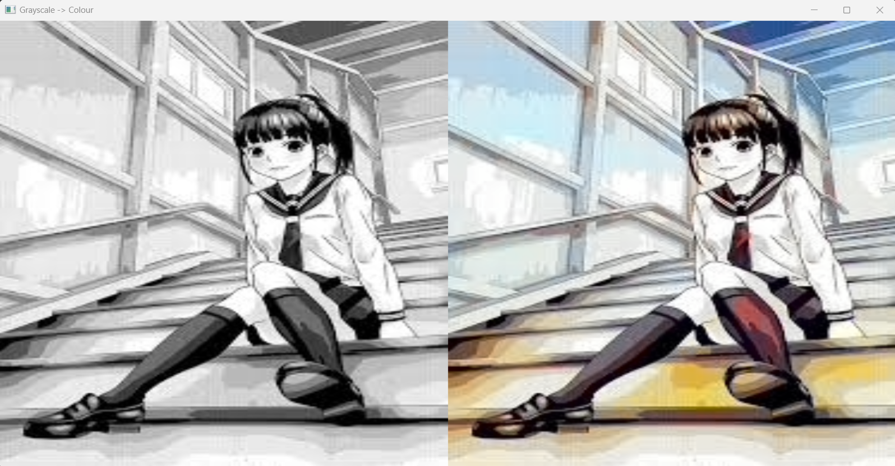

  
##### Next: [Project Closing](E-Project_Closing.md)
