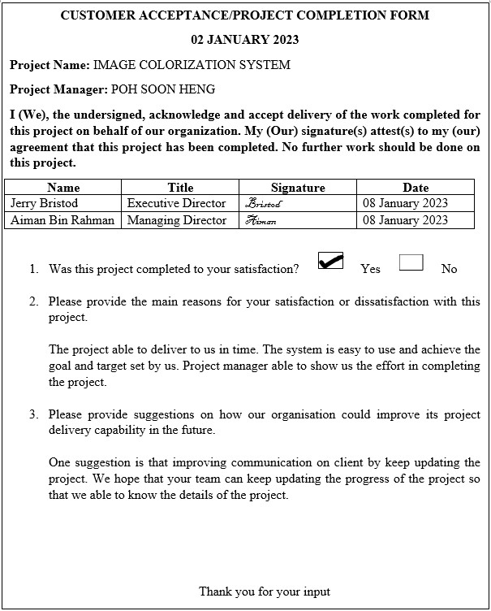
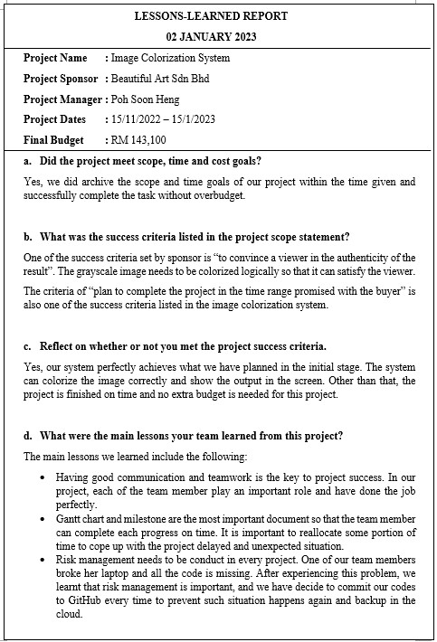
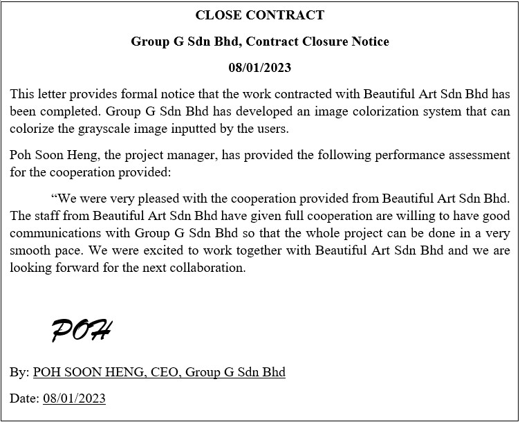

# PROJECT OVERVIEW
## E. COMPLETING THE PROJECT
### Closing Checklist
 

#### 1. Customer Acceptance Form

#### 2. Lessons Learned Document

#### 3. Final Project Report

**IMAGE COLORIZATION SYSTEM**

**1.0 PROJECT OBJECTIVES**

The Image Colorization System is done by Group G Sdn Bhd was intended to develop an Artificial Intelligence (AI) system that are able to colorize the grayscale image to a colorful image.

**2.0 SUMMARY OF THE PROJET RESULTS**

After the system has been completed, it is able to colorize the grayscale image.

**3.0 ORIGINAL AND ACTUAL BUDGET**

The actual budget matches the original budget, which means that the team has followed the budget planned at the beginning of the project and does not use any excessive money that exceed the budget planned.

**4.0 PROJECT ASSESSMENT**

**4.1 SCOPE**

The project scope was initiated from the beginning of the project. For instance, the system is not able to colorize some image naturaly and visually accepted. The colorize image might not look nice and the color used may not be suitable.

**4.2 OBJECTIVES**

Group G Sdn Bhd managed to achieve the objectives initialized since the beginning of the project. A system that is AI powered, which uses deep learning technique has been made. Deep learning is used in this project to colorize grayscale image.

**4.3 IMPACTS**

By creating this system, the actual scene of the grayscale image can be visualized. Grayscale images are regarded as irreplaceable, with exceptional artistic value. It is impossible to fully image the actual scene because color is a very important segment of visual representation. The colorization of grayscale images strongly changes viewers' perspective.

**5.0 TRANSITION PLAN**

Group G Sdn Bhd staff will provide support when require. The main work of support provided by Group G Sdn Bhd's staff on the image colorization system project are as below:

a. Maintain and make sure the system well-funtioning

b. Handling errors and updates of the system

c. Provide user guidelines for Beautiful Art Sdn Bhd to use the system.

d. Report information to senior management on monthly basis

#### 4. Close Contract

