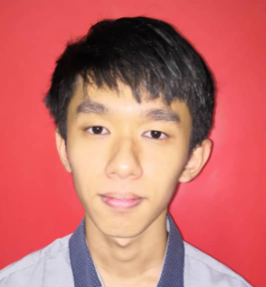

# ABOUT GROUP G SDN BHD
Group G Sdn Bhd is setup by a group of Bachelor Computer Science (Artificial Intelligence) students in UTeM. They are passionate and innovative individuals working together to implement AI software and product in the system for daily usage.

They are based in Malacca, Malaysia.

## OUR MISSION
GIVING BACK ARTIFICIAL INTELLIGENCE(AI) TECHNOLOGY TO THE COMMUNITY AND DAILY LIFE

## Innovation
We committed to openness and inclusiveness, gathering together outstanding researchers in AI in a collaborative and constructive spirit to boldly attack challenging problems with high social and economic impact.

## OUR TEAM
**CHIEF EXECUTIVE OFFICIAL (CEO)**

**POH SOON HENG**

Resposiblity:
1. Manage the company staff and organization workflow
2. Making major corporate decisions 
3. Manage and allocate the resources of the company
4. Make sure project meet the dateline

 

**CHIEF OPERATING OFFICIAL (COO)**

**MUHAMAD A’IMAN TSUBAAQ BIN SHAMSUL KAMAL**

Responsibility:
1. Report directly to CEO on any project progress and status
2. Identify risks and threat that might be happened in the company
3. Aids CEO in attending public events and meet more people on the community
4. Maintain public relations with other members of the company

 

**CHIEF TECHNOLOGY OFFICIAL (CTO)**

**NURSYAZA NISA BINTI ARFARIZAL**

Responsiblity:
1. Make decision on the image colorization technology needed
2. Create the policy for the company to unsure a safe and secure development and production environment
3. Communicate with all levels to make sure the ideas and project are able to be delivered
4. Manage the technical staff available in the company and seprate the task based on their expertise

 
